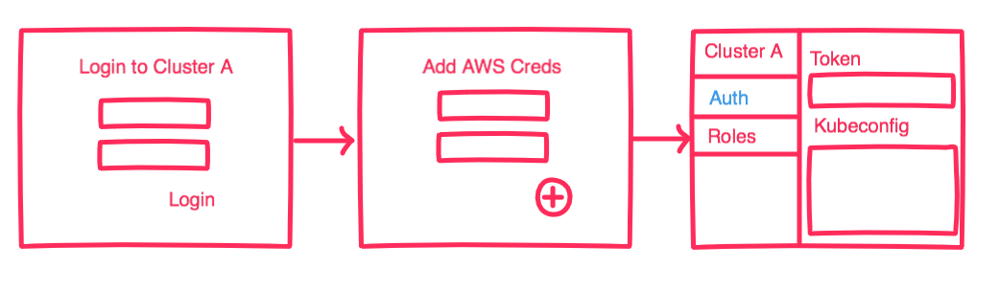

### SSO - Auth solution for EKS

This is a design proposal to enable SSO auth via an identity provider like Auth0, into a Kubernetes cluster in AWS EKS.

AWS EKS uses IAM to provide authentication to your Kubernetes cluster with RBAC enabled for authorization. The RBAC mechanisms is native to Kubernetes and uses native primitives like `roles` and `role bindings` to configure authorization for a give user and or group.


**Auth Limitations**

While Kubernetes itself supports many different [authentication schemes](https://kubernetes.io/docs/reference/access-authn-authz/authentication/), EKS only supports [Webhook Token authentication](https://kubernetes.io/docs/reference/access-authn-authz/authentication/#webhook-token-authentication).

Additonally the webhook endpoint which EKS uses isn't configurable and is hardcoded to talk to a [Heptio Authenticator](https://github.com/heptio/authenticator) endpoint.


**Auth Flow**

EKS requires the following to be configured to allow a tool like `kubectl` to connect to a Kubernetes cluster:

* Download Heptio CLI and ensure binary is in your PATH
* Configure kubeconfig to use the Heptio CLI for the EKS cluster

Any command run via kubectl will then execte the Heptio CLI to get a token which is passed along with the request to the Kubernetes API server. That same token is then validated via the server portion of the Heptio and returns a user according to the mappings stored in `aws-auth` `configMap` stored in `kube-system` namespace of the kubernetes cluster you are connecting to.


**Current Authentication Sequence:**


**Potential Auth Flow for SSO integration**

To enable SSO via an IdP, we could provide an authetnicating proxy that is a service we bootstrap at EKS cluster creation time. The authenticating service's role is to:

* Redirect user to IdP or authenticate user by sending LDAP credentials to IdP
* Once a user is authenticated, present a token to the user and kubeconfig that they can use to configure their machine to connect to the cluster.


**What could this look like?**

1. Bob -> Brenda (here is the endpoint to connect to my cluster)

```
https://cluster-name.ims.io
```

2. Brenda -> opens browser and navigates to the url and works through the auth workflow



3. Brenda then copies the config to her local machine

```yaml
apiVersion: v1
clusters:
- cluster:
    server: <endpoint-url>
    certificate-authority-data: <base64-encoded-ca-cert>
  name: kubernetes
contexts:
- context:
    cluster: kubernetes
    user: aws
  name: aws
current-context: aws
kind: Config
preferences: {}
users:
- name: aws
  user:
    exec:
      apiVersion: client.authentication.k8s.io/v1alpha1
      command: heptio-authenticator-aws
      args:
        - "token"
        - "-i"
        - "<cluster-name>"
```

3. `kubectl config set-context aws` to the new cluster and is now able to connect to Bob's cluster


**KubeConfig Options regarding Heptio Authenticator**

Unfortunately, authenticating with EKS requires generating tokens via locally installed binary. 


**Option A (continue using heptio authenticator)**

Although we could bypass a user having the heptio authenticator installed locally, and have our service generate tokens, our service would become a bottle neck. If our service goes down, so will users' ability to connect to a kubernetes cluster. 

So using the SSO endpoint to provide initial bootstrapping of default roles for a cluster and continuing to rely on a user having the heptio authenticator installed locally and their aws profiles correctly configured would be safer approach.


**Option B (generate tokens using our service)**

If we wanted to avoid having the user download a binary we could return the user a different kubeconfig that could `curl` our endpoint with basic auth or IAM creds and we could return a token for them using those creds.

The downside of this is that it requires the service to be up for each cluster. 

```
users:
- name: aws
  user:
    exec:
      apiVersion: client.authentication.k8s.io/v1alpha1
      command: curl
      args:
        - "http://endpoint"
        - "-i"
        - "<cluster-name>"
        - "$AWS_ACCESS_KEY_ID"
        - "$AWS_SECRET_ACCESS_KEY"
```


**Bootstrapping default set of roles and permissions**

Mapping between IAM users and Kubernetes users is done via an configmap in the Kubernets cluster. For example:

```yaml
apiVersion: v1
data:
  mapRoles: |
    - rolearn: arn:aws:iam::555555555555:role/devel-worker-nodes-NodeInstanceRole-74RF4UBDUKL6
      username: system:node:{{EC2PrivateDNSName}}
      groups:
        - system:bootstrappers
        - system:nodes
  mapUsers: |
    - userarn: arn:aws:iam::555555555555:user/admin
      username: admin
      groups:
        - system:masters
    - userarn: arn:aws:iam::111122223333:user/ops-user
      username: ops-user
      groups:
        - system:masters
  mapAccounts: |
    - "111122223333"
```


`mapRoles` and `mapUsers` is somewhat problematic (subjective opinion) as you have to pre-configure your AWS account with the required roles/users to map from. `mapAccounts` on the other hand allows every AWS user and role to be automatically mapped to a user in a Kubernetes Cluster with the ARN as the username. This would allow us to use kubernetes to completely manage authorization around a user rather than having to spread that concern over AWS and Kubernetes.


**Automatic role mapping**

Since we need a authenticating service to provide SSO, we could also pre-configure a newly authenticating cluster user to create default role and cluster role (if one doesn't already exist) and bind the user to that role and/or cluster role.

